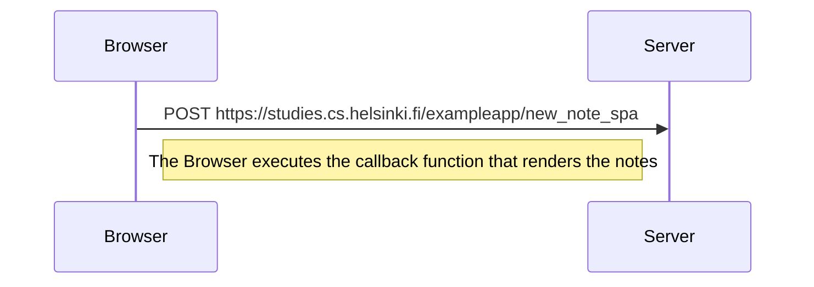

    Saves Notes Single Page App - Save Button
    Assuming the page is already loaded in the browser

```mermaid
sequenceDiagram
    participant Browser
    participant Server

    Browser->>Server: POST https://studies.cs.helsinki.fi/exampleapp/new_note_spa
    Activate Server

    Note right of Browser: The Browser executes the callback function that renders the notes
```